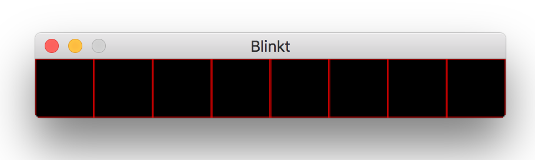

# Emulator for Blinkt!

Emulates blinkt api on non pi devices with a small ui.  
[Blinkt on Github](https://github.com/pimoroni/blinkt)
[Blinkt documentation](http://docs.pimoroni.com/blinkt/#)
[Where to buy](https://shop.pimoroni.com/products/blinkt)




## Install

```shell
pip install git+https://github.com/eruvanos/blinktemu.git
```

## Usage

```python
from blinkt import set_pixel

set_pixel(0, 100,100,100)
```

The emulator supports all official functions from [Blinkt API](http://docs.pimoroni.com/blinkt/#module-blinkt)

* `blinkt.clear()`
* `blinkt.set_all(r, g, b, brightness=None)`
* `blinkt.set_brightness(brightness)`
* `blinkt.set_clear_on_exit(value=True)`
* `blinkt.set_pixel(x, r, g, b, brightness=None)`
* `blinkt.show()`


## Limitations

**Co-existence with Blinkt:**  
This module can not be installed in the same environment like the original **blinkt** module.
